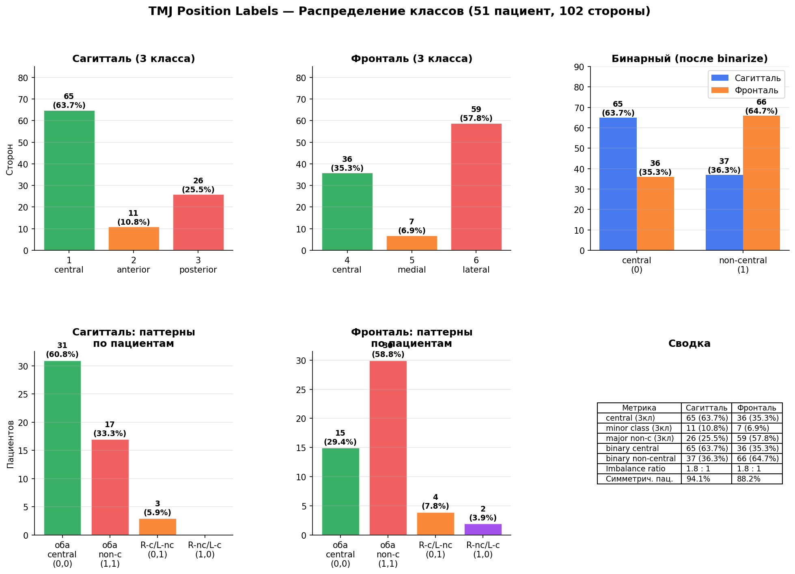

# MLService / docs

В каталоге **только этот** `README.md` (остальное — рисунки и т.п., не Markdown). Ниже: классификатор положения и анализ датасета.

---

## TMJ Position Classifier

3D CNN модель, предсказывающая положение головок ВНЧС по данным КЛКТ.

Реализована в рамках [issue #67](https://github.com/tzopiz/MasterProject/issues/67).

---

### Задача

Для каждого КЛКТ-объёма модель выдаёт **четыре дискретные метки**:

| Метка | Проекция | Сторона | Классы |
|---|---|---|---|
| `sag_right` | Сагиттальная | Правая | 0 — центральное, 1 — мезиально, 2 — дистально |
| `sag_left`  | Сагиттальная | Левая  | 0 — центральное, 1 — мезиально, 2 — дистально |
| `fr_right`  | Фронтальная  | Правая | 0 — центральное, 1 — медиально, 2 — латерально |
| `fr_left`   | Фронтальная  | Левая  | 0 — центральное, 1 — медиально, 2 — латерально |

Маппинг кодов из `tmj_position_labels.json`:
- Сагиттальные коды 1–3 → класс `код − 1`
- Фронтальные коды 4–6 → класс `код − 4`

---

### Зависимости данных

| Файл | Описание |
|---|---|
| `data/dataset_cbct_public/manifest_private.json` | Таблица соответствия `study_id` ↔ `patient_name`. Содержит ФИО — **не коммитить**. |
| `data/tmj_position_labels.json` | Клинические метки по пациентам (сагитталь/фронталь). |
| `data/dataset_cbct_public/study_*/` | Папки с `.dcm` файлами серий. |

---

### Структура файлов

```
MLService/
├── training/
│   ├── tmj_position_label_table.py       # Stage 1: join manifest + labels
│   └── datasets/
│       └── tmj_position_dataset.py       # Stage 2: PyTorch Dataset + DataLoader
├── models/
│   └── tmj_position_classifier.py        # Stage 3: 3D CNN модель
├── train_tmj_position_classifier.py       # Stage 4: скрипт обучения
└── tests/
    ├── test_tmj_position_label_table.py   # Stage 5: тесты маппинга и индекса
    └── test_tmj_position_classifier_model.py  # Stage 5: тесты формы тензоров
```

---

### Обучение

```bash
cd MLService

./venv/bin/python train_tmj_position_classifier.py \
    --dataset-root    data/dataset_cbct_public \
    --labels-json     data/tmj_position_labels.json \
    --manifest-private data/dataset_cbct_public/manifest_private.json \
    --epochs 100 \
    --batch-size 2 \
    --output-dir experiments/position_run1
```

Все аргументы CLI:

| Аргумент | Умолчание | Описание |
|---|---|---|
| `--dataset-root` | `data/dataset_cbct_public` | Папка с `study_*` |
| `--labels-json` | `data/tmj_position_labels.json` | Файл меток |
| `--manifest-private` | `data/dataset_cbct_public/manifest_private.json` | Манифест |
| `--epochs` | 100 | Число эпох |
| `--batch-size` | 2 | Размер батча |
| `--lr` | 1e-4 | Скорость обучения |
| `--weight-decay` | 1e-5 | L2-регуляризация |
| `--downsample-factor` | 6 | Коэффициент даунсэмплинга |
| `--split-ratio` | 0.8 | Доля train (сплит по пациентам) |
| `--lr-patience` | 10 | Patience для ReduceLROnPlateau |
| `--early-stopping` | 30 | Patience раннего останова |
| `--device` | авто | `cpu` / `cuda` / `mps` |
| `--output-dir` | `experiments` | Корень экспериментов |

Артефакты в `experiments/position_<timestamp>/`:
- `config.json` — конфиг запуска
- `best_model.pth` — лучший чекпоинт (по средней val accuracy)
- `metrics.jsonl` — метрики per-epoch (JSONL)
- `train.log` — лог обучения

---

### Запуск тестов

```bash
cd MLService
./venv/bin/python -m pytest tests/test_tmj_position_label_table.py \
                             tests/test_tmj_position_classifier_model.py -v
```

---

### Архитектура модели

```
TMJPositionClassifier
├── backbone  (4 × ConvBlock3d → MaxPool3d)
│   Conv3d(1→16) → BN → ReLU → Conv3d → BN → ReLU → MaxPool3d(2)
│   Conv3d(16→32) → … → MaxPool3d(2)
│   Conv3d(32→64) → … → MaxPool3d(2)
│   Conv3d(64→128) → … → MaxPool3d(2)
├── AdaptiveAvgPool3d(1)  →  (B, 128)
├── head_sag_right  Linear(128→256) → ReLU → Dropout → Linear(256→3)
├── head_sag_left   (то же)
├── head_fr_right   (то же)
└── head_fr_left    (то же)
```

Loss: `CrossEntropyLoss` × 4, суммируется.
Метрика сохранения чекпоинта: **средняя accuracy** по всем четырём головам на val.

---

### Ограничения MVP (итерация 1)

> **Центральный кроп вместо ROI-детектора.**
>
> Модель принимает фиксированный центральный кроп фиксированного размера
> (по умолчанию 96×128×128 вокселей после даунсэмплинга ×6) из всего объёма.
> Это убирает зависимость от детектора, но снижает точность, так как кроп
> может не захватить обе головки при нестандартном положении пациента.

#### Переход ко второй итерации (отдельный этап #67)

1. Использовать выходы `TMJDetector` (координаты головок) для вычисления
   индивидуальных кропов вокруг левой и правой головки.
2. Передать два кропа в две отдельные ветки энкодера или использовать один
   общий энкодер с разными кропами.
3. Убрать `DEFAULT_CROP` как гиперпараметр — размер кропа задаётся детектором.


---

## TMJ Dataset Analysis — Распределение классов

Источник: `data/tmj_position_labels.json` (51 пациент, 102 стороны — каждый пациент даёт left + right).  
Исходный документ: `Кл случаи Чибисова.docx` (врачебная разметка, хранится локально, не в git — содержит ПД).



---

### Легенда кодов

| Плоскость | Код | Название |
|-----------|-----|----------|
| Сагитталь | 1 | Central — центральное положение головки |
| Сагитталь | 2 | Anterior — смещение кпереди (мезиально) |
| Сагитталь | 3 | Posterior — смещение кзади (дистально) |
| Фронталь  | 4 | Central — центральное положение |
| Фронталь  | 5 | Medial — медиальное смещение |
| Фронталь  | 6 | Lateral — латеральное смещение |

---

### Распределение (102 стороны = 51 пациент × 2)

#### Сагитталь — 3 класса

| Класс | Кол-во | % |
|-------|--------|---|
| 1 — central   | 65 | **63.7%** |
| 3 — posterior | 26 | 25.5% |
| 2 — anterior  | 11 | **10.8%** ← редкий класс |

#### Фронталь — 3 класса

| Класс | Кол-во | % |
|-------|--------|---|
| 6 — lateral | 59 | **57.8%** |
| 4 — central | 36 | 35.3% |
| 5 — medial  |  7 | **6.9%** ← очень редкий класс |

---

### Бинарный (после `binarize_labels`: central=0, non-central=1)

| | central (0) | non-central (1) | Ratio |
|--|:-----------:|:---------------:|:-----:|
| Сагитталь | 65 (63.7%) | 37 (36.3%) | 1.8 : 1 |
| Фронталь  | 36 (35.3%) | 66 (64.7%) | 1.8 : 1 (обратный) |

Дисбаланс **умеренный** (1.8:1), не критичный. `BinaryFocalLoss` с `alpha=auto` компенсирует автоматически.

---

### Паттерны симметрии по пациентам

#### Сагитталь (51 пациент)

| Паттерн (right, left) | Пациентов | % |
|-----------------------|-----------|---|
| (0,0) — оба central     | 31 | **60.8%** |
| (1,1) — оба non-central | 17 | **33.3%** |
| (0,1) — асимметрия      |  3 | 5.9% |
| (1,0) — асимметрия      |  0 | 0% |

#### Фронталь (51 пациент)

| Паттерн (right, left) | Пациентов | % |
|-----------------------|-----------|---|
| (1,1) — оба non-central | 30 | **58.8%** |
| (0,0) — оба central     | 15 | **29.4%** |
| (0,1) — асимметрия      |  4 | 7.8% |
| (1,0) — асимметрия      |  2 | 3.9% |

---

### Ключевые выводы

1. **Дисбаланс умеренный (1.8:1)** — не катастрофический, `BinaryFocalLoss` справляется.

2. **Редкие классы в 3-классовой задаче** — anterior (10.8%) и medial (6.9%) крайне мало. При 3-классовом обучении эти классы практически не выучиваются (предсказываются как majority). Для них нужны либо отдельные бинарные классификаторы, либо ещё больше данных.

3. **Высокая симметрия** — 94% пациентов в сагиттали и 88% во фронтали имеют одинаковое положение на обеих сторонах. Это означает, что записи left/right **не являются независимыми** — один пациент вносит коррелированные данные. Эффективный размер датасета меньше чем кажется (102 записи ≠ 102 независимых наблюдения).

4. **Эффективный независимый датасет** — ~51 пациент, не 102 стороны. При patient-level split валидация работает правильно, но val сет содержит всего 8-10 пациентов (~16-20 сторон) — метрики нестабильны.

5. **Для надёжной оценки** нужен 5-fold CV по пациентам (не по сторонам).

---

### Совместимость с манифестом

- `tmj_position_labels.json`: 51 пациент
- `manifest_private.json`: 107 исследований, 40 уникальных пациентов с метками (после join)
- **11 пациентов из labels** не нашли совпадения в manifest (возможно, их DICOM-файлы не были загружены в датасет)


---

## Черновики

Каталог `superpowers/` в корневом `.gitignore` — не опирайтесь на него в CI.
