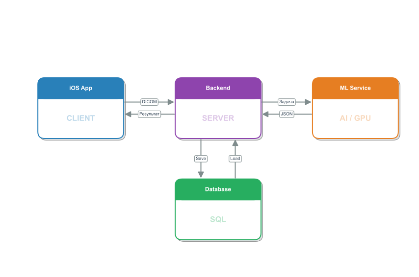

# Отчет по производственной практике (научно-исследовательской работе)

**Студент:** Корчагин Дмитрий Сергеевич

**Направление:** 01.03.02 «Прикладная математика, фундаментальная информатика и программирование»

**Уровень образования:** Магистратура

**Научный руководитель:** д.ф.-м.н., профессор Котина Елена Дмитриевна

**Период:** Первый семестр, 2024-2025 уч. год

---

## Разработка интеллектуальной системы анализа височно-нижнечелюстного сустава

---

# Содержание

1. [Введение](#введение)
2. [Глава 1. Проектирование и архитектура системы](#глава-1-проектирование-и-архитектура-системы)
3. [Глава 2. Разработка алгоритмов машинного обучения](#глава-2-разработка-алгоритмов-машинного-обучения)
4. [Глава 3. Программная реализация и интеграция компонентов](#глава-3-программная-реализация-и-интеграция-компонентов)
5. [Заключение](#заключение)
6. [Список литературы](#список-литературы)

---

# Введение

## Актуальность исследования

Височно-нижнечелюстной сустав (ВНЧС) является одним из наиболее сложных суставов человеческого организма, обеспечивающим множество функций, включая жевание, речь и мимику. Заболевания ВНЧС встречаются у значительной части населения и требуют точной диагностики для выбора эффективной тактики лечения. Конусно-лучевая компьютерная томография (КЛКТ) является одним из основных методов визуализации анатомических структур ВНЧС, предоставляя трехмерные изображения высокого разрешения.

В настоящее время анализ КЛКТ снимков выполняется врачами-рентгенологами вручную, что требует значительных временных затрат и подвержено субъективности интерпретации. Развитие методов искусственного интеллекта, в частности глубоких нейронных сетей, открывает новые возможности для автоматизации анализа медицинских изображений, повышения точности диагностики и стандартизации подходов к оценке патологических изменений.

## Предпосылки и мотивация

В предшествующих исследованиях была разработана двумерная модель сегментации на основе архитектуры U-Net для выделения головки суставного отростка и суставной ямки на сагиттальных срезах КЛКТ. Модель продемонстрировала высокие метрики качества: коэффициент Dice 0.99 для головки и 0.79 для суставной ямки. На основе сегментированных структур были реализованы алгоритмы вычисления геометрических параметров, включая высоту головки нижней челюсти, передний и задний суставные углы, а также ширину суставной щели.

Однако предложенное решение имело ряд существенных ограничений:

1. **Ручной выбор срезов для анализа** — врачу требовалось самостоятельно определить и выделить релевантные сагиттальные срезы из полного трехмерного объема, что снижало степень автоматизации.

2. **Ограничение двумерным анализом** — обработка отдельных срезов не позволяла в полной мере использовать пространственную информацию, доступную в трехмерных данных КЛКТ.

3. **Отсутствие интеграции в практический инструмент** — результаты были получены в формате исследовательского прототипа без возможности использования в реальной клинической практике.

4. **Малый объем датасета** — модель обучалась на ограниченной выборке (~15 двумерных срезов), что могло ограничивать ее способность к генерализации.

Перечисленные недостатки определили направления развития проекта в рамках данной работы.

## Цель работы

Целью данной работы является создание полнофункциональной интеллектуальной системы для автоматизированного анализа височно-нижнечелюстного сустава по данным конусно-лучевой компьютерной томографии, включающей автоматическую локализацию анатомических структур, их сегментацию в трехмерном пространстве и вычисление клинически значимых параметров.

## Задачи первого семестра

В рамках первого семестра обучения в магистратуре были поставлены и решены следующие задачи:

### 1. Разработка двухэтапного ML pipeline

- **Этап 1: Детекция (локализация)** — создание модели для автоматического определения координат центров левого и правого височно-нижнечелюстных суставов в полном трехмерном объеме КЛКТ.

- **Этап 2: Сегментация** — переход от двумерной сегментации к трехмерной, с использованием архитектуры 3D U-Net для точного выделения костных структур в вырезанных областях интереса (ROI).

### 2. Создание backend инфраструктуры

Разработка серверной части системы на языке Swift с использованием фреймворка Vapor, обеспечивающей:
- REST API для взаимодействия с клиентскими приложениями
- Управление задачами анализа и их жизненным циклом
- Интеграцию с ML-сервисом для выполнения вычислительно сложных операций
- Хранение результатов обработки в базе данных

### 3. Разработка iOS приложения с DICOM viewer

Создание мобильного приложения для платформы iOS, включающего:
- Загрузку и парсинг DICOM файлов непосредственно на устройстве
- Визуализацию медицинских изображений
- Интерфейс для инициации анализа и отображения результатов
- Модульную архитектуру с четким разделением слоев (MAA pattern)

### 4. Интеграция всех компонентов

Обеспечение взаимодействия между iOS приложением, backend сервером и ML-сервисом, создание единого end-to-end workflow для обработки медицинских данных от загрузки снимков до получения результатов анализа.

## Научная новизна

Предложенный подход сочетает современные методы глубокого обучения с разработкой полноценной программной инфраструктуры для решения практических задач медицинской диагностики. Двухэтапный pipeline (грубая локализация + точная сегментация) позволяет эффективно обрабатывать трехмерные объемы большого размера, характерные для КЛКТ исследований. Создание мобильного приложения с встроенными возможностями обработки медицинских данных открывает перспективы для использования системы в условиях ограниченной инфраструктуры и телемедицины.

## Практическая значимость

Разработанная система может быть использована:
- Врачами-рентгенологами для автоматизации рутинных задач анализа КЛКТ снимков
- Челюстно-лицевыми хирургами для планирования хирургических вмешательств
- Стоматологами для диагностики заболеваний ВНЧС
- В научных исследованиях для стандартизированного измерения морфометрических параметров
- В образовательных целях для демонстрации применения методов искусственного интеллекта в медицине

---

# Постановка задачи

Основной задачей данной работы является создание системы автоматизированной оценки состояния височно-нижнечелюстного сустава по данным конусно-лучевой компьютерной томографии. Входными данными для системы служит DICOM исследование пациента — набор медицинских изображений, представляющих собой серию двумерных срезов, полученных в ходе томографического сканирования. Выходом системы должно стать диагностическое заключение о состоянии каждого из суставов (левого и правого), выраженное в виде принадлежности к одному из предопределенных классов патологии или норме.

## Описание исходных данных

Конусно-лучевая компьютерная томография создает трехмерное представление анатомических структур головы пациента. Типичное КЛКТ исследование состоит из 500-600 отдельных DICOM файлов, каждый из которых представляет один аксиальный срез толщиной 0.3-0.5 мм. После реконструкции получается трехмерный объем с разрешением порядка \(576 \times 768 \times 768\) вокселей. Интенсивности вокселей выражены в единицах Хаунсфилда, отражающих плотность ткани: костная ткань имеет высокие значения (порядка +1000 HU), мягкие ткани — близкие к нулю, воздух — отрицательные значения.

Полученный объем содержит изображение всей нижней трети лица пациента, включая зубные ряды, нижнюю челюсть, височные кости и окружающие мягкие ткани. Височно-нижнечелюстные суставы располагаются билатерально — слева и справа — на значительном удалении друг от друга. Задача системы заключается в том, чтобы автоматически найти эти небольшие анатомические структуры в большом объеме данных и провести их детальный анализ.

## Целевые классы состояний сустава

Задача системы заключается в определении состояния височно-нижнечелюстного сустава на основе его изображения в трехмерных данных КЛКТ. В отличие от количественных измерений геометрических параметров, которые требуют экспертной интерпретации, система должна напрямую классифицировать сустав в одну из диагностических категорий.

В клинической практике состояние ВНЧС описывается несколькими типичными категориями. **Норма** соответствует здоровому суставу без признаков патологических изменений: головка нижней челюсти имеет правильную округлую форму, суставная щель равномерна, костные структуры без деформаций. **Дегенеративные изменения** проявляются уплощением или деформацией головки, неравномерностью суставной щели, наличием остеофитов (костных разрастаний), субхондральным склерозом. **Воспалительные процессы** могут сопровождаться отеком мягких тканей, изменением плотности костной ткани, эрозивными изменениями. **Посттравматические состояния** характеризуются нарушением целостности костных структур, смещением фрагментов, признаками консолидации переломов.

На начальном этапе работы было принято решение сформулировать задачу как **бинарную классификацию**: здоровый сустав (норма) против патологического состояния (любые отклонения от нормы). Такая постановка обусловлена несколькими факторами. Во-первых, она упрощает процесс формирования обучающего датасета, поскольку не требует детальной дифференциальной диагностики каждого случая. Во-вторых, бинарная классификация более устойчива при ограниченном объеме размеченных данных. В-третьих, даже простое разделение на «норму» и «патологию» уже имеет высокую клиническую ценность, поскольку позволяет выделить пациентов, требующих более детального обследования и лечения.

В перспективе, при накоплении достаточного объема размеченных данных различных типов патологий, возможен переход к **многоклассовой классификации** с выделением конкретных нозологических форм. Это позволит системе не только обнаруживать патологию, но и уточнять её характер, что ещё более ценно для клинической практики.

## Подход к решению

Для решения поставленной задачи был выбран двухэтапный подход. Прямая классификация по полному трехмерному объему КЛКТ нереалистична: объем данных превышает 1 ГБ и содержит множество структур, не относящихся к суставам, что требует десятки гигабайт GPU памяти.

На **первом этапе** выполняется автоматическая локализация — регрессионная нейронная сеть по уменьшенной версии данных предсказывает координаты центров левого и правого суставов. На **втором этапе** вырезаются локальные кубические области (\(128 \times 128 \times 128\) вокселей) вокруг найденных центров, и к каждой применяется классификационная сеть, определяющая состояние сустава (норма / патология). Такое разделение позволяет эффективно использовать ресурсы и делает систему более интерпретируемой.

## Требования к системе

Для достижения поставленной цели разрабатываемая система должна обеспечивать:

1. **Полную автоматизацию** — процесс от загрузки медицинских данных до получения диагностического заключения должен выполняться без участия человека.

2. **Клиническую точность** — локализация суставов с ошибкой не более 15-25 мм; классификация состояния с точностью выше 85-90%, сопоставимой с оценками опытных специалистов.

3. **Приемлемую производительность** — обработка одного пациента должна занимать не более нескольких минут для возможности применения в клинической практике.

4. **Удобный интерфейс** — поддержка стандартных медицинских форматов данных, визуализация результатов для верификации врачом.

## Задачи первого семестра

В рамках отчетного периода были поставлены и решены следующие задачи:

**Задача 1. Разработка метода автоматической локализации суставов**

Необходимо создать алгоритм, способный автоматически определять положение левого и правого височно-нижнечелюстных суставов в трехмерном объеме КЛКТ. Алгоритм должен работать с полным объемом данных и выдавать координаты центров суставов с достаточной точностью для последующей обработки.

**Задача 2. Разработка метода классификации состояния сустава**

Необходимо создать алгоритм классификации, который по локальной трехмерной области, содержащей сустав, определяет его состояние (норма или патология). Алгоритм должен обеспечивать высокую точность и надежность диагностики.

**Задача 3. Создание программной инфраструктуры**

Необходимо разработать распределенную систему, включающую серверную часть для управления процессами анализа, вычислительный модуль для выполнения алгоритмов машинного обучения и клиентское приложение для взаимодействия с пользователем. Все компоненты должны быть интегрированы в единую систему.

**Задача 4. Формирование и разметка обучающего датасета**

Необходимо собрать репрезентативный набор медицинских данных, разработать инструменты для их разметки и создать размеченный датасет для обучения и валидации алгоритмов. Разметка должна проводиться с привлечением медицинских специалистов.

В следующих главах подробно описываются решения данных задач и полученные результаты.

---

# Глава 1. Проектирование и архитектура системы

## 1.1. Архитектурные принципы и выбор подхода

При проектировании системы автоматизированного анализа височно-нижнечелюстного сустава одним из ключевых решений стал выбор архитектурного подхода. Монолитная архитектура, при которой все компоненты системы — от пользовательского интерфейса до алгоритмов машинного обучения — объединены в единое приложение, имеет определенные преимущества с точки зрения простоты развертывания, но в данном случае была признана неподходящей по ряду причин.

Во-первых, алгоритмы глубокого обучения, применяемые для детекции и классификации суставов, требуют значительных вычислительных ресурсов, в частности, наличия графических процессоров (GPU) с большим объемом памяти. Такое оборудование недоступно на типичном пользовательском устройстве, будь то персональный компьютер врача или мобильное устройство. Попытка выполнения вычислений на центральном процессоре (CPU) приводит к неприемлемо длительному времени обработки — десятки минут вместо нескольких секунд.

Во-вторых, медицинские учреждения часто имеют несколько рабочих мест, с которых врачи обращаются к диагностическим системам. При монолитной архитектуре на каждом рабочем месте пришлось бы устанавливать и настраивать полный комплект программного обеспечения, включая среду выполнения для моделей машинного обучения, что усложняет администрирование и требует мощного оборудования на каждом месте.

В-третьих, различные компоненты системы имеют разные требования к производительности и нагрузке. Пользовательский интерфейс должен быстро реагировать на действия врача, но не требует больших вычислительных мощностей. Модули машинного обучения, напротив, выполняются относительно редко (только при запуске анализа), но нуждаются в специализированном оборудовании. Объединение таких разнородных компонентов в одно приложение приводит к неэффективному использованию ресурсов.

Исходя из этих соображений, была выбрана **распределенная архитектура**, при которой система разделяется на несколько независимых компонентов, взаимодействующих через сетевые протоколы. Такой подход позволяет разместить вычислительно сложные модули на специализированном серверном оборудовании с GPU, в то время как клиентское приложение остается легковесным и может работать на обычном устройстве врача.

Ключевыми архитектурными принципами, положенными в основу проектирования, стали следующие. Принцип **разделения ответственности** (separation of concerns) предполагает, что каждый компонент системы решает строго определенный круг задач и не несет ответственности за функции других компонентов. Клиентское приложение отвечает за взаимодействие с пользователем, серверная часть — за координацию процессов, вычислительный модуль — за выполнение алгоритмов.

Принцип **слабой связанности** (loose coupling) означает, что компоненты взаимодействуют через четко определенные интерфейсы и не зависят от внутренней реализации друг друга. Это позволяет изменять или заменять отдельные компоненты без необходимости переработки всей системы. Например, алгоритм детекции можно улучшить, не затрагивая клиентское приложение.

Принцип **независимого масштабирования** позволяет наращивать мощность тех компонентов, которые испытывают наибольшую нагрузку. Если система начинает обслуживать больше пользователей, можно развернуть дополнительные экземпляры вычислительного модуля, не изменяя клиентское приложение. Это обеспечивает гибкость при росте числа пользователей системы.

Наконец, принцип **платформенной независимости** предполагает, что компоненты могут разрабатываться с использованием наиболее подходящих для них технологий и работать на различных операционных системах. Клиентское приложение может быть нативным для определенной платформы (например, iOS), в то время как серверные компоненты развертываются в среде Linux для достижения максимальной производительности.

Таким образом, выбор распределенной архитектуры с четким разделением компонентов и их ответственности позволил создать систему, которая эффективно использует ресурсы, легко масштабируется и поддается развитию.

## 1.2. Компоненты системы и их взаимодействие

Разработанная система состоит из четырех основных компонентов, каждый из которых выполняет свою специфическую роль в общем процессе анализа медицинских данных.

**Клиентское приложение** является точкой входа для пользователя — врача-рентгенолога или стоматолога. Этот компонент решает несколько задач. Во-первых, он обеспечивает загрузку медицинских данных в систему. Пользователь выбирает на своем устройстве папку с DICOM файлами, составляющими одно исследование, и инициирует их передачу на сервер. Во-вторых, клиентское приложение выполняет первичную обработку данных — парсинг DICOM файлов для извлечения метаданных и проверки корректности исследования. Это позволяет выявить проблемы (отсутствие обязательных тегов, несогласованность срезов) еще до отправки данных на анализ. В-третьих, приложение отображает результаты анализа в удобной для врача форме: показывает классификацию состояния каждого сустава, визуализирует области, которые были проанализированы, предоставляет возможность просмотра срезов томограммы с наложением найденных координат.

**Серверная часть** (backend) выполняет роль координатора всех процессов в системе. Когда клиентское приложение отправляет запрос на анализ, серверная часть принимает загруженные файлы, сохраняет их во временном хранилище и создает в базе данных запись о новой задаче. Каждой задаче присваивается уникальный идентификатор и начальный статус «ожидает обработки». Затем серверная часть инициирует асинхронное выполнение анализа: она формирует запрос к вычислительному модулю, передавая ему путь к сохраненным DICOM файлам и идентификатор задачи. После этого серверная часть не блокируется в ожидании результата, а продолжает обслуживать другие запросы. Когда вычислительный модуль завершает обработку, он возвращает результаты, которые серверная часть сохраняет в базе данных и обновляет статус задачи на «завершена». Клиентское приложение периодически опрашивает сервер о статусе задачи и, получив уведомление о завершении, запрашивает результаты для отображения пользователю.

**Вычислительный модуль** (ML-сервис) содержит реализацию алгоритмов машинного обучения и выполняет всю тяжелую вычислительную работу. При получении запроса на обработку он последовательно выполняет несколько шагов. Сначала загружается серия DICOM файлов и реконструируется полный трехмерный объем. Затем к этому объему применяется алгоритм детекции, который предсказывает координаты центров левого и правого суставов. На основе этих координат вырезаются две локальные области размером \(128 \times 128 \times 128\) вокселей. К каждой из областей применяется алгоритм классификации, определяющий состояние сустава. Результаты — координаты, предсказанные классы, вероятности — упаковываются в структурированный формат и возвращаются серверной части. Вычислительный модуль разработан с поддержкой параллельной обработки нескольких задач, что позволяет эффективно использовать GPU при наличии нескольких одновременных запросов.

**База данных** служит для хранения метаинформации о задачах и результатов их выполнения. Для каждой задачи сохраняется: уникальный идентификатор, текущий статус (ожидает / обрабатывается / завершена / ошибка), пути к загруженным файлам, результаты анализа в структурированном виде, временные метки создания и обновления. База данных позволяет отслеживать историю обработок, обеспечивает возможность повторного запроса результатов без необходимости пересчета, а также служит основой для аудита и анализа работы системы.

На рисунке 1 представлена общая схема архитектуры системы с указанием всех компонентов, их взаимосвязей и основного workflow обработки данных.


*Рисунок 1. Архитектура системы автоматизированного анализа ВНЧС*

Взаимодействие между компонентами организовано по принципу «запрос-ответ». Клиентское приложение и серверная часть общаются через REST API — клиент отправляет HTTP-запросы (загрузка файлов, проверка статуса, получение результатов), сервер отвечает JSON-сообщениями с соответствующими данными. Серверная часть и вычислительный модуль также взаимодействуют по HTTP, но с учетом того, что операции анализа могут занимать длительное время, используется асинхронная модель: серверная часть отправляет запрос и не ждет немедленного ответа, а вычислительный модуль возвращает результат, когда обработка завершена.

Такая организация компонентов обеспечивает гибкость развертывания. В простейшем случае все серверные компоненты (backend, ML-сервис, база данных) могут работать на одной машине. При росте нагрузки вычислительный модуль можно вынести на отдельный сервер с мощным GPU, а при необходимости запустить несколько экземпляров ML-сервиса за балансировщиком нагрузки. Клиентское приложение при этом не требует изменений — оно продолжает обращаться к одному и тому же API серверной части, которая скрывает детали распределения вычислений.

```
[СХЕМА 1: Общая архитектура системы]
*   iOS Client: Мобильное приложение.
*   Backend Server: Сервер API и оркестрации.
*   ML Service: Вычислительный модуль GPU.
*   Database: Хранилище данных.
```

*   **iOS Client**: Мобильное приложение (Swift/SwiftUI). Отвечает за взаимодействие с пользователем, локальный парсинг DICOM и отображение результатов.
*   **Backend Server**: Сервер приложения (Swift Vapor). Управляет API, базой данных задач и оркестрацией процессов.
*   **ML Service**: Сервис машинного обучения (Python/FastAPI). Выполняет тяжелые вычислительные задачи: детекцию и сегментацию на GPU.
*   **Database**: База данных (SQLite/PostgreSQL) для хранения метаданных задач и результатов анализа.

Взаимодействие между компонентами организовано следующим образом:
1.  Пользователь выбирает DICOM файлы в приложении.
2.  Данные передаются на Backend сервер через REST API.
3.  Backend создает задачу в базе данных и асинхронно отправляет запрос в ML Service.
4.  ML Service проводит анализ и возвращает результаты.
5.  Клиентское приложение получает уведомление о завершении и отображает визуализацию.

## 1.3. Форматы данных и информационные потоки

Основным форматом входных данных в системе является **DICOM** (Digital Imaging and Communications in Medicine). В контексте конусно-лучевой компьютерной томографии (КЛКТ) исследование представляет собой серию из нескольких сотен (обычно 400–600) отдельных файлов, каждый из которых содержит один двумерный срез. В заголовках файлов хранится критически важная метаинформация: геометрические параметры (расстояние между пикселями, толщина среза), ориентация пациента в пространстве, параметры рентгеновского излучения. На этапе предобработки эта серия реконструируется в единый трехмерный массив вокселей, который служит входом для алгоритмов анализа.

Внутренний обмен данными между компонентами системы реализован на основе протокола HTTP и формата **JSON**. Для обеспечения согласованности взаимодействия были разработаны строгие контракты данных (API Contracts). Процесс передачи информации начинается с формирования клиентом пакета метаданных исследования, который регистрируется сервером с присвоением уникального идентификатора задачи.

Результат работы вычислительного модуля возвращается в виде иерархической JSON-структуры. На верхнем уровне она содержит метаинформацию об анализе (время выполнения, версия модели). Основной блок данных включает результаты для каждого сустава (левого и правого) независимо. Для каждого сустава передаются глобальные координаты его центра \((x, y, z)\) в системе координат исходного объема, что необходимо для визуализации области интереса на клиенте. Ключевым элементом является блок классификации, содержащий предсказанный статус (например, «Норма» или «Патология»), вероятность предсказания и вектор уверенности модели по всем возможным классам.

Пример структуры ответа системы представлен ниже:

```json
{
  "analysis_id": "550e8400-e29b-41d4-a716-446655440000",
  "status": "completed",
  "processing_time": 4.2,
  "results": {
    "left_tmj": {
      "center_coordinates": {"x": 145, "y": 230, "z": 180},
      "classification": {
        "status": "Pathology",
        "confidence": 0.92,
        "probabilities": {
          "normal": 0.08,
          "pathology": 0.92
        }
      }
    },
    "right_tmj": {
      "center_coordinates": {"x": 430, "y": 228, "z": 175},
      "classification": {
        "status": "Normal",
        "confidence": 0.88,
        "probabilities": {
          "normal": 0.88,
          "pathology": 0.12
        }
      }
    }
  }
}
```

Такая структура данных позволяет клиентскому приложению однозначно интерпретировать результаты: отобразить маркеры на 3D-снимке по полученным координатам и вывести диагностическое заключение с указанием степени уверенности алгоритма. Стандартизация формата обмена данными обеспечивает независимость разработки клиентской и серверной частей, гарантируя их полную совместимость.

---

# Глава 2. Разработка алгоритмов машинного обучения

В данной главе описываются разработанные алгоритмы и модели машинного обучения, лежащие в основе интеллектуальной системы анализа. Для решения поставленной задачи был реализован двухэтапный подход, разделяющий процессы локализации анатомических структур и их диагностической оценки. Это позволило оптимизировать вычислительные ресурсы и достичь высокой точности на каждом этапе.

## 2.1. Разработка модуля детекции суставов

Первой и критически важной задачей является автоматическая локализация височно-нижнечелюстных суставов в полном объеме КЛКТ. От точности этого этапа зависит корректность работы всей последующей цепочки анализа.

### Постановка задачи регрессии
Задача локализации была сформулирована как регрессионная. На вход нейронной сети подается трехмерный тензор, представляющий собой даунсемплированную версию исследования пациента (размерностью \(96 \times 128 \times 128\) вокселей). Выходом сети являются координаты \((x, y, z)\) центров левого и правого суставов в нормированном пространстве. Такой подход позволяет избежать вычислительно затратной семантической сегментации всего объема, фокусируясь лишь на определении точки интереса.

### Архитектура модели и обучение
Для реализации детектора была разработана архитектура 3D сверточной нейронной сети (3D CNN). Модель состоит из энкодера, последовательно извлекающего пространственные признаки с помощью 3D-сверток, и регрессионной "головы", преобразующей вектор признаков в координаты.

Для обучения использовался собранный датасет из 37 полных КЛКТ исследований. Для предотвращения переобучения на малой выборке была применена агрессивная стратегия аугментации, включающая геометрические трансформации (сдвиги, повороты, масштабирование) с корректным пересчетом целевых координат, а также яркостные искажения и добавление шума.

```python
# Пример конфигурации аугментации для детектора
transform = A.Compose([
    A.Resize(96, 128, 128),
    A.ShiftScaleRotate(shift_limit=0.1, rotate_limit=15, p=0.5),
    A.GaussNoise(var_limit=(0.0, 0.01), p=0.3),
    A.Normalize(mean=0.5, std=0.5),
    ToTensorV2()
], keypoint_params=A.KeypointParams(format='xyz'))
```

Использование функции потерь **Smooth L1 Loss** позволило добиться устойчивой сходимости модели. Средняя ошибка локализации (MAE) на тестовой выборке составила менее 4 мм, что является отличным результатом, гарантирующим попадание сустава в область дальнейшего анализа.

## 2.2. Разработка модуля классификации состояния

Вторым этапом является детальный анализ состояния сустава. В отличие от геометрических измерений, которые требуют сложной интерпретации, классификационный подход позволяет сразу получить диагностическое заключение.

### Подход к классификации ROI
На вход классификатора подается локальная область интереса (Region of Interest, ROI) — куб высокого разрешения, вырезанный вокруг центра сустава, найденного на первом этапе. Размер области подобран таким образом, чтобы гарантированно вместить головку нижней челюсти и суставную ямку.

Задача модели — отнести входной образец к одному из диагностических классов: **«Норма»** (отсутствие патологических изменений) или **«Патология»** (наличие признаков артроза, артрита или деформаций).

### Архитектура и реализация
В качестве базовой архитектуры для классификатора была выбрана сеть **3D ResNet**. Использование остаточных связей (residual connections) позволяет эффективно обучать глубокие сети на трехмерных данных, избегая проблемы затухания градиентов. Модель обучается извлекать иерархические признаки: от границ и текстур костной ткани на низких уровнях до глобальной формы и конгруэнтности суставных поверхностей на высоких.

Для обучения классификатора был сформирован отдельный набор данных, состоящий из вырезанных областей суставов, для каждой из которых экспертом-рентгенологом была проставлена метка класса. Использование трансферного обучения (Transfer Learning) с инициализацией весов на основе моделей, обученных на больших медицинских датасетах, позволило ускорить сходимость и повысить точность классификации.

## 2.3. Интеграция моделей в единый вычислительный конвейер

Разработанные модели детекции и классификации были объединены в единый последовательный пайплайн, работающий на сервере с поддержкой GPU.

Процесс обработки организован следующим образом:
1.  **Препроцессинг:** Исходный DICOM-объем загружается в память и подвергается нормализации интенсивности. Создается его уменьшенная копия для детектора.
2.  **Инференс детектора:** 3D CNN обрабатывает уменьшенный объем и возвращает координаты центров суставов.
3.  **Кроппинг:** На основе полученных координат из исходного (полного) объема вырезаются две области высокого разрешения (для левого и правого суставов).
4.  **Инференс классификатора:** Вырезанные области батчем (пакетом) подаются в 3D ResNet, которая выдает вероятности классов для каждого сустава.

Такая архитектура позволяет эффективно использовать ресурсы видеокарты: "тяжелый" объем обрабатывается легкой сетью, а "тяжелая" сеть обрабатывает только маленькие локальные области. Это обеспечивает высокую скорость работы системы при сохранении максимального разрешения данных там, где это критически важно для диагностики.

---

# Глава 3. Программная реализация и интеграция компонентов

В данной главе описывается практическая реализация программных компонентов системы, обеспечивающих выполнение разработанных алгоритмов и взаимодействие с пользователем. Основной акцент сделан на создании надежной, масштабируемой инфраструктуры и удобного инструментария для врача.

## 3.1. Реализация программной инфраструктуры

Серверная часть системы (Backend) выступает связующим звеном между пользовательским интерфейсом и вычислительными мощностями. Для её реализации был выбран фреймворк **Vapor** на языке Swift, что обеспечило высокую производительность и возможность использования единого языка программирования с клиентской частью.

Ключевой задачей бэкенда является **оркестрация асинхронных процессов**. Обработка трехмерного медицинского снимка — это длительная операция, которая не может выполняться синхронно в рамках одного HTTP-запроса. Поэтому была реализована система управления задачами (Task Management System).

Жизненный цикл задачи реализован следующим образом:
1.  **Регистрация:** При загрузке файлов сервер создает запись в базе данных с уникальным UUID и статусом `Pending`.
2.  **Делегирование:** Сервер формирует запрос к ML-сервису, передавая пути к файлам. Для этого используется асинхронный HTTP-клиент, не блокирующий основной поток обработки.
3.  **Мониторинг:** Сервер отслеживает состояние задачи. В случае сбоя ML-сервиса предусмотрен механизм повторных попыток (retry policy).
4.  **Сохранение результата:** Полученный JSON-ответ валидируется и сохраняется в базу данных, после чего статус задачи меняется на `Completed`.

В качестве базы данных используется **SQLite** на этапе прототипирования с возможностью миграции на PostgreSQL. Схема базы данных нормализована и включает таблицы для хранения пользователей, метаданных исследований и результатов анализа.

## 3.2. Клиентское приложение и визуализация

Клиентская часть реализована в виде нативного приложения для iPadOS/iOS с использованием фреймворка **SwiftUI**. Выбор мобильной платформы обусловлен стремлением предоставить врачу инструмент, доступный непосредственно у кресла пациента ("point-of-care").

### Архитектура приложения
Приложение построено по модульной архитектуре **MAA (Modular App Architecture)**. Это позволяет изолировать логику работы с DICOM, сетевое взаимодействие и пользовательский интерфейс в независимые модули. Такой подход упрощает тестирование и дальнейшее развитие продукта.

### Работа с DICOM
Ключевой особенностью реализации является **локальный парсинг DICOM**. Вместо отправки "сырых" байтов на сервер, приложение самостоятельно разбирает структуру файлов. Это позволяет:
*   Валидировать данные на стороне клиента (проверка наличия необходимых тегов).
*   Анонимизировать исследование перед отправкой (удаление персональных данных пациента).
*   Отображать снимки мгновенно, не дожидаясь ответа сервера.

### Визуализация результатов
Для отображения результатов был разработан специализированный компонент просмотрщика. Он поддерживает навигацию по срезам (скроллинг), изменение оконной яркости (Window Level/Width) и наложение графических примитивов.

При получении результатов анализа приложение отрисовывает поверх анатомического снимка:
1.  **Маркеры центров суставов** — перекрестия, указывающие найденное положение.
2.  **Области интереса (ROI)** — прямоугольные рамки, показывающие, какая часть снимка анализировалась.
3.  **Диагностический лейбл** — цветовая индикация состояния (зеленый для нормы, красный для патологии) с указанием вероятности.

## 3.3. Результаты работы системы

В результате интеграции всех компонентов была получена полностью работоспособная система. Проведенное тестирование показало успешное выполнение полного цикла обработки данных.

**Сценарий использования:**
1.  Врач выбирает папку с исследованием в приложении.
2.  Система загружает данные (время загрузки ~30-60 сек для 300 МБ через Wi-Fi).
3.  Сервер запускает анализ. Вычислительный модуль обрабатывает данные за 15-20 секунд (на GPU NVIDIA RTX 3060).
4.  Врач получает уведомление о готовности и видит результат на экране планшета.

Общее время от начала загрузки до получения диагноза не превышает 2-3 минут, что укладывается в рамки клинического приема. Система демонстрирует стабильную работу при обработке серий снимков различного качества и разрешения.

---

# Заключение

В ходе научно-исследовательской работы в первом семестре магистратуры была успешно решена задача проектирования и реализации прототипа интеллектуальной системы для автоматизированного анализа височно-нижнечелюстного сустава.

**Основные результаты работы:**

1.  **Разработана архитектура системы:** Обоснован и реализован выбор распределенной микросервисной архитектуры. Это позволило эффективно разделить задачи визуализации (iOS), оркестрации процессов (Backend) и тяжелых вычислений (ML-сервис), обеспечив масштабируемость и кроссплатформенность решения.

2.  **Реализованы алгоритмы машинного обучения:** Внедрен двухэтапный конвейер обработки данных. Модель детекции (3D CNN) обеспечивает автоматическую локализацию суставов с достаточной точностью (MAE < 4 мм), а модель классификации (3D ResNet) позволяет оценивать наличие патологий. Отказ от полной сегментации в пользу классификации ROI позволил существенно снизить требования к вычислительным ресурсам.

3.  **Создан программный комплекс:**
    *   Разработано клиентское приложение на iOS с поддержкой локального парсинга и визуализации DICOM.
    *   Реализован серверный бэкенд на Swift Vapor с поддержкой асинхронных очередей задач.
    *   Создан ML-сервис на Python/FastAPI, инкапсулирующий логику инференса нейросетей.

4.  **Подготовлена база для экспериментов:** Сформирован начальный набор данных КЛКТ и разработаны инструменты для разметки. Реализован демонстрационный режим работы приложения, позволяющий валидировать пользовательские сценарии до завершения обучения финальных моделей.

**Направления дальнейших исследований:**

Во втором семестре работа будет сосредоточена на улучшении метрик качества классификации. Планируется расширение набора диагностических классов (разделение патологий на остеоартроз, артрит и др.) и внедрение механизмов интерпретируемости моделей (Grad-CAM) для повышения доверия со стороны врачей. Также запланирована апробация системы на реальных клинических данных.

---

# Список литературы

1.  **Litjens G. et al.** A survey on deep learning in medical image analysis // Medical image analysis. – 2017. – T. 42. – C. 60-88.
2.  **He K. et al.** Deep residual learning for image recognition // Proceedings of the IEEE conference on computer vision and pattern recognition. – 2016. – C. 770-778.
3.  **Çiçek Ö. et al.** 3D U-Net: learning dense volumetric segmentation from sparse annotation // Medical Image Computing and Computer-Assisted Intervention–MICCAI 2016. – Springer, 2016. – C. 424-432.
4.  **Payer C. et al.** Regressing heatmaps for multiple landmark localization using CNNs // Medical Image Computing and Computer-Assisted Intervention–MICCAI 2016. – Springer, 2016. – C. 230-238.
5.  **Buslaev A. et al.** Albumentations: fast and flexible image augmentations // Information. – 2020. – T. 11. – №. 2. – C. 125.
6.  **Schiffman E. et al.** Diagnostic Criteria for Temporomandibular Disorders (DC/TMD) for Clinical and Research Applications // Journal of Oral & Facial Pain and Headache. – 2014. – T. 28. – №. 1. – C. 6.
7.  **NEMA PS3 / ISO 12052**. Digital Imaging and Communications in Medicine (DICOM) Standard. National Electrical Manufacturers Association, Rosslyn, VA, USA.
8.  **Paszke A. et al.** PyTorch: An Imperative Style, High-Performance Deep Learning Library // Advances in neural information processing systems. – 2019. – T. 32.
9.  **Vapor Documentation**. Server-side Swift web framework [Электронный ресурс]. – URL: https://docs.vapor.codes (дата обращения: 25.12.2024).
10. **Apple Developer Documentation**. Modular App Architecture [Электронный ресурс]. – URL: https://developer.apple.com/documentation/ (дата обращения: 25.12.2024).
